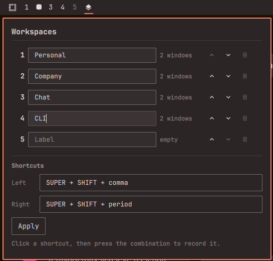

# Workspace Shift



Reorder Omarchy workspaces by swapping their windows. Hyprland cannot renumber workspaces, and the built-in `omarchy.workspaces` widget stays numeric — this plugin exchanges the mapped, non-pinned windows (and your labels) between two ids instead. The panel lists the same active range as the bar (always 1–5, plus any higher live workspace up to 10), including empty slots in the middle.

Click the bar icon to rename workspaces, move a row up or down, or drag the handle. Default Super+Shift+, and Super+Shift+. swap the current workspace with its neighbor; click a shortcut in the panel and press a combo to change it.

## Install

```sh
omarchy plugin add https://github.com/danihenrique/omarchy-workspace-shift.git --enable
```

Place it in the bar:

```sh
omarchy bar move io.github.danihenrique.workspace-shift --section left|center|right
```

On first enable, the plugin writes a managed bind block into `~/.config/hypr/bindings.lua` and reloads Hyprland. You can also apply binds from the panel, or:

```sh
~/.config/omarchy/plugins/io.github.danihenrique.workspace-shift/scripts/apply-binds
```

## Manual setup

This plugin **writes a managed block** into `~/.config/hypr/bindings.lua` (markers `-- BEGIN io.github.danihenrique.workspace-shift` / `-- END io.github.danihenrique.workspace-shift`). Only that uniquely owned, structurally validated block is edited or removed. Review the file after install or after clicking Apply. The plugin does not prompt before writing the block. Legacy lines that mention the plugin script are left untouched unless you pass `--migrate-legacy` (exact-line delete of the absolute script path only).

Uninstall requires an explicit removal step **before** `omarchy plugin remove`, because the helper that strips the block lives inside the plugin folder (see Uninstall).

Config (`~/.config/omarchy/workspace-shift.json`) and bindings are opened with a root-to-leaf `openat`/`O_NOFOLLOW` walk; missing directories are created only via `mkdirat` on that walk. Writes recheck the target identity before `replace` and treat the directory `fsync` as the commit (previous bytes are restored if that fsync fails). The panel reads config through `scripts/safe_io.py read --max-bytes 65536` and rejects oversize before QML materializes the file.

Workspace swaps are **best-effort**. Moves take an exclusive descriptor-safe lock (`~/.local/state/omarchy/workspace-shift/swap.lock`, opened with `O_NOFOLLOW` and never truncated through a symlink). Clients are snapshotted first; more than 256 Hyprland clients aborts the swap (fail closed, no partial success). After the moves, addresses are audited against the expected post-swap layout (and src/dest/temp must not hold unexpected clients). Drift aborts, rolls windows back, and does **not** swap labels. If label persist fails after a successful move, previous config bytes are restored and windows are rolled back. Compositor probes use `systemd-run --user --pipe` (`RuntimeMaxSec`, `KillSignal=SIGKILL`) with `hyprctl | head -c`. A compositor failure can still leave windows elsewhere — refresh the panel if something looks wrong.

Two-way swaps use a temporary empty workspace under that lock. The plugin prefers ids 8/9/10, then 7/6/3, then an unused high id 11–99 (Hyprland creates it on demand), then remaining 1–5. It re-queries immediately before the first move and picks another id (or aborts) if that workspace is no longer empty.

## Super+Shift+comma

On US QWERTY, `<` is Shift+comma. The panel records the combo you press (e.g. `SUPER + SHIFT + comma`) rather than free-typed bind strings. Apply still also registers extra `SUPER + less` / `SUPER + greater` binds, because Hyprland will register `SUPER + less` but that key does not fire.

## Usage

- **Bar icon** — open the Workspaces panel
- **Labels** — edit a row and it saves immediately to `~/.config/omarchy/workspace-shift.json`
- **Up / down / drag / Super+Shift+,.** — swap that workspace's windows *and* label with the neighbor (labels travel with the window set). Workspace numbers stay numeric; empty slots in the active range stay visible.
- **Shortcuts** — click Left or Right, then press a combination that includes Super, Ctrl, or Alt. The control records Omarchy `o.bind` syntax and applies immediately. Apply re-applies the current binds.
- **CLI** — `scripts/workspace-shift left|right` or `scripts/workspace-shift swap SRC DEST`

This plugin does **not** replace `omarchy.workspaces`.

## Uninstall

You **must** strip the managed Hypr binds *before* removing the plugin:

```sh
~/.config/omarchy/plugins/io.github.danihenrique.workspace-shift/scripts/apply-binds --remove
omarchy plugin remove io.github.danihenrique.workspace-shift
```

`apply-binds --remove` deletes the block between `-- BEGIN io.github.danihenrique.workspace-shift` and `-- END io.github.danihenrique.workspace-shift` in `~/.config/hypr/bindings.lua`. Review that file after removal. If you already removed the plugin, delete that block by hand and run `hyprctl reload`.
